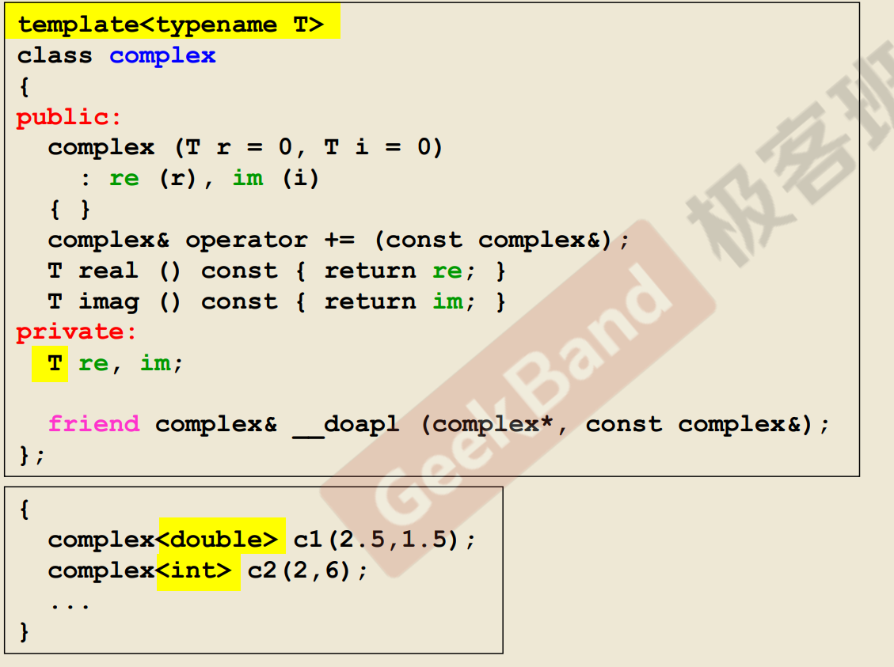

 

 1. `c/c++` 的不同之处 

 c 缺乏某些关键字。包内的变量，一般设置为全局。所有的函数都能访问 

 c++ 将数据和函数，封装到一起构成了类，从外部访问看不到数据成员 

 2. `template` 简介 





3. 关于`inline`

函数可以指定为 `inline`， 但是对于特别复杂的函数。即使指定为 `inline` ，编译器也因为能力有限，无法把它视为 `inline` 函数。 ？


4. 关于访问级别 access level 

数据成员 最好放到 `private` 中

函数成员根据需要，放到 `public` 或  `private` 中 

5. 构造函数默认实参 
```c++
complex(double r = 0, double i = 0 ) : re(r), im (i)
{
    
    
}
```