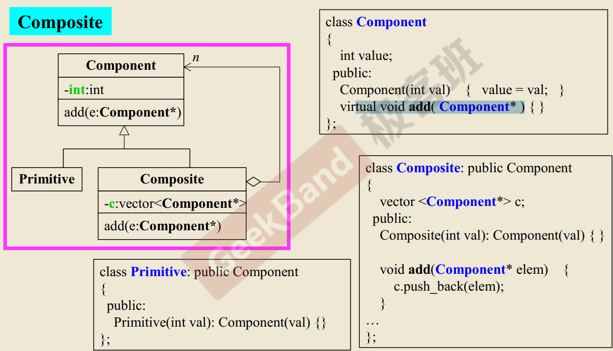

# OOP 

## 类和类之间的关系 

1. Composition 复合
2. Inheritance 继承
3. Delegation 委托

## 1.Composition （复合）关系

所谓 `复合` 即包含关系。即 `has-a`


如上例，即是 `Composition` 关系。 类 `queue` 中，包含 `Sequence` 类型的变量 `c`. 


### Adapter 模式 

`adapter` 单词的意思是 适配。 

在上图当中就是`adapter` 模式的体现。`queue` 类中封装的各种操作。其实是直接调用了 `deque<T>` 标准库的操作。也就是说`queue` 类只是对`deque<T>`的操作进行了适配，抽取了几个功能。 `queue` 是一个单边队列， `deque` 是个双边队列。 
  
### Composition 关系下的构造和析构 


如上图，`Containter` 包含 `Component`

如果 `Containter` 的构造函数不使用初始化器，编译器将为其合成，也就是会首先调用 `Component` 的 `default` 构造函数，然后才执行自己，所以构造函数是由内而外的。 

```c++
Containter::Container(...) : Component() {}
```

对于析构函数是由外而内的。`Containter`的析构函数会首先执行自己，然后再调用`Component` 的析构函数 
```cpp
Containter::~Container(...){... ~Component()}
```

## 2. Delegation (委托) Composition by reference 


通俗来讲就是 用引用的方式来组合。`String` class 当中有个 指针。类型是`StringRep`. 这个类封装了 字符串的内部实现。 对于用户来讲，会直接调用 `String` class 提供的接口。 这是一种比较灵活的实现方式，`String` class 中的 指针可以指向不同的类型。 从而使用不用的接口 

左下角的图片。是说`a, b, c` 3个变量使用同一个指针，引用了同一块内存。这一块内存存放的字符串为`hello`. 一般再调用下面的代码时，会发生这个事情。

```c++
String a = "hello";
String b = a, c = a; 
```
a, b ,c 的`rep` 变量指向同一块内存。如果此时`a` 的内容又发生变化。会发生`copy on write` ，也就是`写时copy`

## 3.Inheritance(继承)，表示 `is-a`

```cpp
struct _List_node_base
{
    _List_node_base *_M_next;
    _List_node_base *_M_prev;
};

template<typename _Tp>
struct _List_node
    : public _List_node_base
{
    _Tp _M_data;
}
```


### inheritance 关系下的构造和析构 


如果我们在派生类的构造函数没有写初始化器的相关内容，编译器将为我们默认自动合成。调用基类的默认构造函数。 


### inheritance with virtual functions 

关于继承关系的类的函数 --> 调用全 

1. `non-virtual` 函数 <br/>
    不希望派生类去改变的函数。

2. `virtual` 函数 <br/>
    父类对函数有默认实现，子类可以对函数覆写 也可以不覆写
    
3. `pure virtual` 函数 
    父类对函数没有默认实现。希望子类可以实现函数定义。 

```cpp
class Shape {
public:
    virtual void draw() const = 0; // pure virtual 
    virtual void error(const std::string& msg); // virtual 
    int objectID() const; // non-virtual 
};

class Rectangle: public Shape{...};
class Ellipse: public Shape {...};  

```


### template method 设计模式 


很多应用程序，都需要打开文件展示内容。它们的基本步骤如上，不同之处在于读取文件内容的操作会不一样。因此有人把这些相同的步骤进行了抽象。做成了类，这个类就是 `CDocument`,详细代码如下：这是一个常用的设计模式，称之为 `Template Method`。那么这个类的特点是：父类的方法，调用了子类封装的方法。 

```cpp
class CDocument
{
public:
    void OnFileOpen()
    {
        cout << "dialog .." << endl;
        cout << "check file status..." << endl;
        cout << "open file..." << endl;
        Serialize(); //读取文件内容
        cout << "close file ..." << endl;
        cout << "update all views ..." << endl;
    }
    virtual void Serialize()
    {} ;
};

class CMyDoc : public CDocument
{
public:
    virtual void Serialize() override
    {
        cout << "CMyDoc::Serialize()" << endl;
    }
};
int main()
{
    CMyDoc myDoc;
    myDoc.OnFileOpen();
}
```


通过子类的对象调用父类的方法
Application framework 会经常使用这种模式。
写 framework 的人会构想出，用户可能会使用的方法。 

关于 子类的对象调用父类的方法时，为什么能使用子类定义的override父类的方法？ 
    调用方法时，会传递this指针。

- `override` 关键字

    指定派生类的函数 覆盖了 基类的虚函数。不加这个关键字，派生类函数，也可以覆盖基类的虚函数。加这个关键字的目的是，1.提高程序可读性 2.编译器会审查此函数是否满足覆盖虚函数的条件(参数是否匹配，是否是const 等)


## 关系组合 

### 1. `inheritance+Composition` 关系下的构造和析构 


派生类 `Derived` 从 `Base` 继承而来，同时包含了 `Component`.
那么在构造 `Derived` 时， `Base` 和 `Component` 以及`Derived` 构造顺序如何呢？ 

```c++ 
Derived::Derived() : Base(), Component() {....} 
```

在析构 `Derived` 时，顺序如何呢？与构造顺序相反  

```c++
Derived::~Derived() {... ~Component(), ~Base()}
```


### 2. `Delegation + Inheritance`

`Oberserver` 设计模式 


解决的问题： 
在`PowerPoint` 上有4张幻灯片。 这4张幻灯片显示的其实是同一个文件。 当编辑其中一个幻灯片，并做出内容上的改变，其他幻灯片也要改变。 
因此`Observer` 模式就解决了这个问题 


### 3. `Composite` 设计模式 

用于解决文件系统或窗口系统的问题  :文件系统中，有目录和文件，目录可以包含文件或目录，目录的目录还可以包括文件和目录。其实就是一个树形结构的问题。

```
UML 图：

下划线: 静态变量 
-：私有变量 
+：公共变量：默认就是公共变量 
#：protocted 变量

类的关系:
1. 组合
2. 委托
3. 继承 

```



如果上面的UML图，表示的是文件系统的设计方法的话。 
`Composite` 类表示的就是目录 ， `Primitive ` 表示的就是文件。 


- `private` 和 `protocted` 的区别 

声明为`private`的成员，不能由该类外边的类或函数访问 
声明为`protocted`的成员，也不能由该类外边的类或函数访问，除了它的派生类。 


### 4. `Prototype` 设计模式 

应用场景：<br/>
一般一些应用程序框架，可能会做一些基类。像`image` ,并且希望用户去继承这个类，实现必要的操作，如`clone`。基类具有，创建和移除这些子类对象的功能，它不必知道子类的对象名称，就可以创建和移除它们。

如何设计：


参考代码 `HouJiePrac/oop/prototypeDesignPattern`