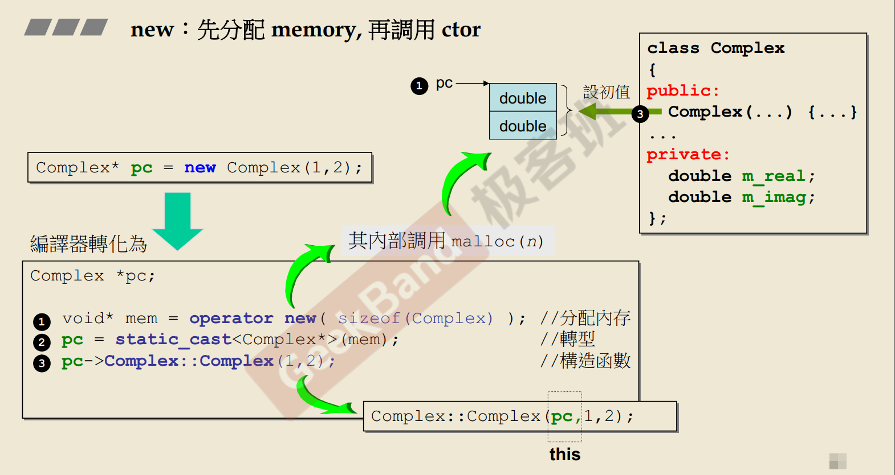
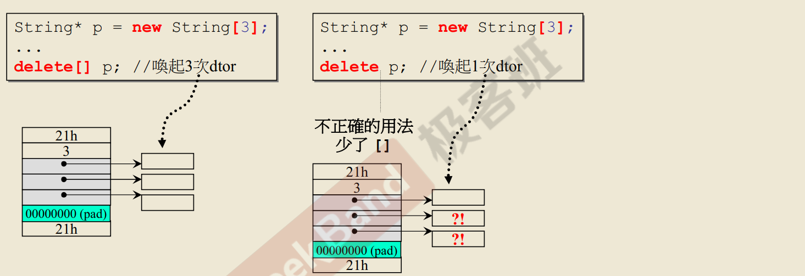

# string class implement 

class with pointer member 


1. 如果一个class 有 `指针`对象。那么必须要有 
`copy ctor` 和 `copy op =`


2. 浅拷贝和深拷贝区别

浅拷贝：只拷贝 `string` 对象的 `char*`
深拷贝：拷贝 `string` 对象的 字符串内存 

浅拷贝可能会造成 `Memory leak` 或 引用非法内存操作  

3. 检测自我赋值

```cpp
inline 
String& String::operator =(const String& str)
{
    if(this == &str) //检测自我赋值 ：不只是为了效率，而且是为了正确性。 
        return *this;

    delete[] m_data;
    m_data = new char[strlen(str.m_data) + 1];
    strcpy(m_data, str.m_data);
    return *this;  
}
``` 

目的是： 如果`A 对象` 要赋值给 `A 对象` 。如果没有检测自我赋值。而是直接 `delete` 左边边的那个对象。 那么接下来的操作，要去取右边的对象。但是因为左右两边是同一个对象。因为已经被`delete` 了，再去取会产生未定义的行为。 

 
4. `new` 操作详解 




5. `delete` string 操作详解 


- 先调用 string 的析构函数. 释放掉指针指向的内存 
- 再调用 `delete` 操作符。释放掉 指针本身 

7. 为什么 `delete array` 要用 `delete[] `, 用 `delete` 会有什么后果 




一个动态分配的`array` 如上图所示. 
左边第一个,是`debug` 模式下的 `Complex array` 内存分配图示.最上边和最下边的是 `cookie` ,用来指示内存块的长度,方便系统去识别内存块的头和尾. 接下来是 32B 的 `debugger header`.然后是数组的长度.占用4B. 这里是 3. 随后是对象的数据.一个复数2个double, 所以这里是6个double. 然后4B `no man land` 用于调试. 之后的字节用于填充内存块.来凑够内存块的大小, 使其大小为 `16B` 的整数倍.

因为 `cookie` 最低4个 bit ,用于指示是拿到的内存,还是要去回收内存.因此 内存块的长度必须是16的整数倍.以把这4个bit清理出来,用作标识使用. 

左边第二个,是 `release` 模式下的 `Complex array` 内存分配图示,与左边第一个的不同之处是 没有32B `Debugger header ` 和 `no man land` 其他,都一样,不再赘述 

右边第一个,是 `debug` 模式下 `string array` 内存分配图示.基本构造与`Copmlex array` ,并没有差别. 最明显的不同是 `string array` 存放的数据是`3个指针`, 它们指向3块内存 


